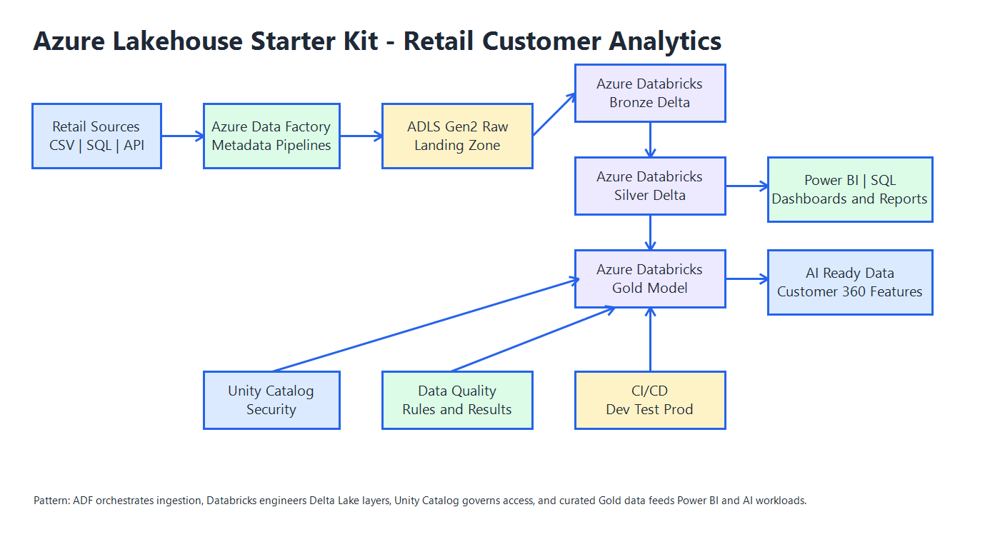
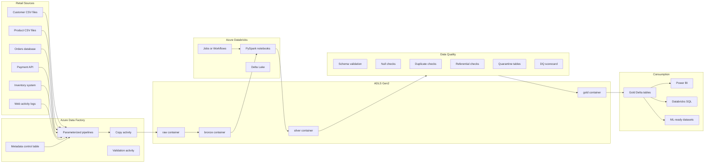

# Azure Lakehouse Starter Kit

[](docs/adf-pipeline-design.md)
[](docs/databricks-notebooks.md)
[](docs/delta-table-design.md)
[](docs/medallion-design.md)
[](docs/data-quality-framework.md)
[](docs/cicd-guide.md)

> A practical Azure Lakehouse starter kit with medallion architecture, ADF ingestion pipelines, Databricks notebooks, Delta Lake tables, data quality checks, and CI/CD templates.

This blueprint demonstrates how to design and implement an enterprise-grade Azure Lakehouse using Azure Data Factory, Azure Data Lake Storage Gen2, Azure Databricks, Delta Lake, PySpark, data quality checks, and CI/CD templates.

The sample business scenario is **Retail Customer Analytics**. The starter kit processes customer, product, order, order item, payment, inventory, and web activity data to support Customer 360 analytics, daily sales reporting, product performance analysis, inventory visibility, customer segmentation, data quality monitoring, Power BI consumption, and AI-ready curated datasets.

## Why This Starter Kit Exists

Many Azure lakehouse examples show one notebook and a small file load. Real projects need orchestration, metadata, folder standards, table design, quality gates, deployment structure, security guidance, and a path from raw source data to trusted business outputs.

This starter kit gives a team a practical starting point:

- ADF pipeline patterns for metadata-driven ingestion.
- Databricks notebooks for Bronze, Silver, Gold, and data quality.
- Delta Lake table design for medallion architecture.
- Sample data and schemas for a retail analytics domain.
- CI/CD templates for Azure DevOps and GitHub Actions.
- Governance, security, cost, troubleshooting, demo, and Wiki content.



## Who Should Use This

| Audience | How It Helps |
| --- | --- |
| Azure data engineers | Use a practical structure for ingestion, transformation, quality, and deployment. |
| Data architects | Explain lakehouse layers, governance, environments, and platform choices. |
| Cloud engineers | Review service connections, Key Vault, identity, and deployment templates. |
| Analytics engineers | Build curated Gold tables for reporting and semantic models. |
| BI engineers | Understand the shape of trusted Power BI-ready Lakehouse outputs. |
| Students | Learn a realistic Azure data engineering project structure. |
| Modernization teams | Use the repo as a proof-of-concept starting point. |

## What Makes This Different From A Basic Tutorial

- It treats the repo like a starter kit for a real delivery team.
- It includes metadata-driven ADF design rather than one-off copy jobs.
- It includes separate Bronze, Silver, Gold, DQ, SQL, CI/CD, and governance assets.
- It uses fictional but realistic retail data.
- It includes practical demo and Wiki material for learning, portfolio, and community use.

## Architecture Overview



## Features

- Professional medallion folder structure.
- Retail Customer Analytics sample domain.
- ADF metadata-driven ingestion pipeline examples.
- Databricks PySpark notebook examples for setup, Bronze, Silver, Gold, DQ, and utilities.
- Delta table DDL and merge examples.
- Data quality control tables, rule examples, and PySpark validation helpers.
- CI/CD templates for Azure DevOps and GitHub Actions.
- Dev/Test/Prod deployment guidance.
- Security, governance, cost, troubleshooting, demo, and roadmap docs.
- Wiki pages for public learning and navigation.

## Technology Stack

| Layer | Technology |
| --- | --- |
| Orchestration | Azure Data Factory |
| Raw storage | Azure Data Lake Storage Gen2 |
| Processing | Azure Databricks, PySpark |
| Table format | Delta Lake |
| Governance | Unity Catalog or Hive metastore, Key Vault, Purview placeholder |
| BI consumption | Power BI, Databricks SQL |
| CI/CD | Azure DevOps, GitHub Actions |
| Testing | Python unit tests and notebook validation scripts |

## Implemented Assets

| Area | Included |
| --- | --- |
| Sample data | Customers, products, orders, order items, payments, inventory, web activity |
| Schemas | JSON contracts for every sample source |
| ADF | Linked services, datasets, metadata table, trigger, and orchestration pipelines |
| Databricks | Setup, Bronze ingestion, Silver cleaning, Gold modeling, DQ, utilities, workflow JSON |
| SQL | Bronze, Silver, Gold DDL, DQ control tables, customer 360 and daily sales views |
| CI/CD | GitHub Actions, Azure DevOps templates, deployment helper scripts |
| Tests | Schema validation, primary key checks, referential checks, transformation checks |
| Wiki | Topic learning portal and implementation handbook pages |

## Repository Structure

```text
azure-lakehouse-starter-kit/
|-- README.md
|-- LICENSE
|-- CONTRIBUTING.md
|-- docs/
|-- diagrams/
|-- adf/
|   |-- pipelines/
|   |-- datasets/
|   |-- linked-services/
|   |-- triggers/
|   `-- metadata/
|-- databricks/
|   |-- notebooks/
|   `-- jobs/
|-- sql/
|   |-- ddl/
|   |-- views/
|   `-- dq/
|-- data/sample/
|-- schemas/
|-- cicd/
|-- scripts/
|-- tests/
`-- wiki/
```

## Prerequisites

- Azure subscription.
- Azure Data Factory.
- ADLS Gen2 storage account.
- Azure Databricks workspace.
- Azure Key Vault.
- Optional Unity Catalog setup.
- Optional Microsoft Purview account.
- Python 3.10 or later for local validation scripts and tests.
- Azure DevOps or GitHub Actions for CI/CD.

## Quick Start

1. Review the architecture in [docs/architecture.md](docs/architecture.md).
2. Review sample data in [data/sample](data/sample).
3. Review metadata-driven ingestion in [adf/metadata](adf/metadata).
4. Review ADF pipeline examples under [adf/pipelines](adf/pipelines).
5. Review Databricks notebooks under [databricks/notebooks](databricks/notebooks).
6. Run local validation:

```powershell
python azure-lakehouse-starter-kit/scripts/validate_notebooks.py
python -m pytest azure-lakehouse-starter-kit/tests
```

## Data Flow

```text
Retail source files and systems
-> Azure Data Factory metadata-driven ingestion
-> ADLS Gen2 raw landing area
-> Bronze Delta tables
-> Silver cleansed and conformed Delta tables
-> Gold dimensional and analytical tables
-> Power BI, Databricks SQL, and ML-ready datasets
```

## Medallion Architecture

| Layer | Purpose |
| --- | --- |
| Raw | Original source extracts in ADLS Gen2 with minimal changes |
| Bronze | Delta tables preserving raw structure plus audit columns |
| Silver | Cleaned, typed, deduplicated, validated business entities |
| Gold | Business-ready dimensional and aggregate tables |

## ADF Pipeline Design

ADF is responsible for orchestration and data movement. It should not hold heavy transformation logic. This kit uses:

- Metadata lookup.
- ForEach source object loop.
- Parameterized Copy activities.
- File arrival validation.
- Databricks notebook activity triggers.
- Pipeline status logging.
- Failure notification placeholders.

## Databricks Notebook Design

Databricks is responsible for transformation, Delta table writes, data quality rules, and Gold table creation. Notebooks are split by responsibility:

- Setup.
- Bronze ingestion.
- Silver cleansing.
- Gold modeling.
- Data quality checks.
- Utilities.

## Delta Table Design

Delta Lake is used for Bronze, Silver, and Gold tables because it supports transactional writes, schema enforcement, scalable metadata handling, and recovery patterns such as time travel.

## Data Quality Framework

The lightweight DQ framework uses:

- `dq_rules`
- `dq_results`
- `dq_rules.yml`
- Schema, null, duplicate, referential integrity, and range checks.

Supported rule types:

- `NOT_NULL`
- `UNIQUE`
- `ACCEPTED_VALUES`
- `RANGE_CHECK`
- `REFERENTIAL_INTEGRITY`
- `SCHEMA_MATCH`
- `DUPLICATE_CHECK`

## Expected Outputs

After running the starter kit in Databricks, you should have:

| Output | Description |
| --- | --- |
| `bronze.brz_customers` and related Bronze tables | Raw Delta tables with ingestion metadata |
| `silver.sil_customers` and related Silver tables | Clean, typed, deduplicated entities |
| `gold.dim_customer` | Customer dimension with surrogate key |
| `gold.dim_product` | Product dimension with surrogate key |
| `gold.fact_sales` | Sales fact table at order-line grain |
| `gold.customer_360` | Customer-level analytics table |
| `gold.vw_customer_360` | Business-friendly customer analytics view |
| `gold.vw_daily_sales` | Daily sales summary view |
| `dq.dq_results` | Data quality pass/fail results |

## CI/CD Process

The starter kit includes examples for:

- Repository structure validation.
- Python lint and compile checks.
- Unit tests.
- Notebook validation.
- ADF artifact deployment placeholder.
- Databricks notebook and job deployment placeholder.
- Dev/Test/Prod environment separation.
- Manual approval before production.

## Security And Governance

Recommended practices:

- Store secrets in Azure Key Vault.
- Use managed identities or service principals.
- Apply ADLS Gen2 RBAC and ACLs.
- Use Unity Catalog where available.
- Separate dev, test, and prod workspaces.
- Identify and protect PII fields.
- Use Microsoft Purview for catalog and lineage when available.
- Capture audit logs and job run metadata.

## Cost Considerations

- Use job clusters instead of all-purpose clusters for scheduled workloads.
- Right-size Databricks clusters and enable autoscaling where useful.
- Avoid small files and over-partitioning.
- Use storage lifecycle policies for raw and archived data.
- Tag resources by environment, project, and owner.
- Monitor unused clusters, pipeline runs, and storage growth.

## Demo Walkthrough

The demo flow is documented in [docs/demo-script.md](docs/demo-script.md):

1. Explain retail analytics business problem.
2. Show architecture and repo structure.
3. Show sample raw data.
4. Walk through ADF pipeline design.
5. Run Bronze, Silver, DQ, and Gold notebooks conceptually.
6. Query `customer_360` and `daily_sales_summary`.
7. Explain CI/CD and extension path to Power BI and AI.

## Roadmap

| Version | Focus |
| --- | --- |
| v1 | Medallion structure, sample data, ADF design, Databricks notebooks, DQ checks, basic CI/CD |
| v2 | Unity Catalog support, Purview guide, Power BI semantic model example, Databricks Asset Bundles, more sources |
| v3 | Streaming ingestion, CDC pattern, feature engineering layer, AI-ready Customer 360, observability dashboard |

## Useful References

- [Azure Data Factory documentation](https://learn.microsoft.com/en-us/azure/data-factory/)
- [Azure Data Factory Copy activity](https://learn.microsoft.com/en-us/azure/data-factory/copy-activity-overview)
- [Azure Databricks Lakehouse](https://learn.microsoft.com/en-us/azure/databricks/lakehouse/)
- [Azure Databricks medallion architecture](https://learn.microsoft.com/en-us/azure/databricks/lakehouse/medallion)
- [Delta Lake on Azure Databricks](https://learn.microsoft.com/en-us/azure/databricks/delta/)
- [Unity Catalog](https://learn.microsoft.com/en-us/azure/databricks/data-governance/unity-catalog/)

## Contributing

Contributions are welcome. Good additions include new pipeline examples, notebook improvements, data quality rules, Unity Catalog examples, Purview guidance, Power BI model notes, and more realistic retail scenarios.

Read [CONTRIBUTING.md](CONTRIBUTING.md) and the root [repository contribution guide](../CONTRIBUTING.md).

## License

This starter kit is released under the MIT License. See [LICENSE](LICENSE).

## Author

Created as part of the **Microsoft Data & AI Learning Blueprints** collection by Ravikiran Pagidi.
