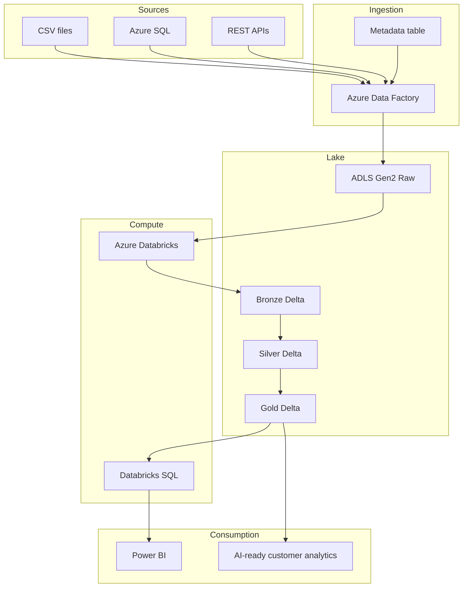

# Architecture

## Purpose

This page explains the recommended starter architecture for an Azure Lakehouse built with ADF, ADLS Gen2, Azure Databricks, Delta Lake, Unity Catalog, and Power BI.

## Architecture Overview

## Design Principles

- Use ADF for orchestration and movement.
- Use Databricks for code-heavy transformations.
- Use Delta Lake for reliable tables, schema evolution, time travel, and transactional writes.
- Use Unity Catalog for governance, access control, and lineage.
- Use Gold tables and views for Power BI consumption.

## Common Mistakes

| Mistake | Better Approach |
| --- | --- |
| Putting all data in one folder | Separate raw, bronze, silver, gold, logs, and checkpoints |
| Transforming everything in ADF | Use ADF for orchestration and Databricks for complex transformations |
| Exposing raw files to analysts | Publish only curated Gold tables or views |
| Skipping governance | Define ownership, access, and PII rules from the start |

## Checklist

- [ ] Architecture separates ingestion, engineering, quality, and consumption.
- [ ] Bronze, Silver, and Gold have clear responsibilities.
- [ ] Storage and table access are governed by Unity Catalog.
- [ ] Power BI consumes business-ready data.

## Related Pages

- [Medallion Design](Medallion-Design)
- [ADF Pipelines](ADF-Pipelines)
- [Security Governance](Security-Governance)

