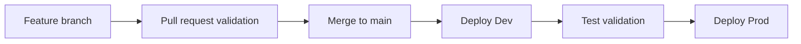

# CI CD

## Purpose

This page explains how the starter kit approaches validation and deployment.

## Included Templates

| Folder | Contents |
| --- | --- |
| `cicd/github-actions` | CI and manual deployment workflows |
| `cicd/azure-devops` | Azure DevOps validation and deployment templates |
| `scripts` | ADF and Databricks deployment helper scripts |
| `tests` | Sample data, schema, and transformation checks |

## Promotion Strategy

## What To Version Control

- ADF pipeline templates
- Databricks notebooks
- SQL scripts
- DQ rules
- Tests
- Documentation
- Job definitions

## What Not To Version Control

- Secrets
- Access tokens
- Production connection strings
- Large data extracts
- Personal workspace exports

## Related Pages

- [ADF Pipelines](ADF-Pipelines)
- [Databricks Notebooks](Databricks-Notebooks)
- [Security Governance](Security-Governance)

