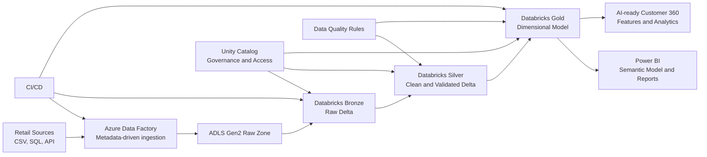

# Azure Lakehouse Starter Kit Wiki

> A practical Azure Lakehouse learning and implementation guide using Azure Data Factory, ADLS Gen2, Azure Databricks, Delta Lake, Unity Catalog, Power BI, and CI/CD.

This Wiki is the learning portal for the `azure-lakehouse-starter-kit` folder in the Microsoft Data and AI Learning Blueprints repository.

## Who This Is For

| Audience | How This Wiki Helps |
| --- | --- |
| Beginners | Learn a real Azure Lakehouse flow step by step |
| Azure Data Engineers | Connect ADF, ADLS Gen2, Databricks, and Delta Lake into one architecture |
| Databricks Practitioners | See practical Bronze, Silver, Gold notebook patterns |
| BI Developers | Understand how curated Gold tables support Power BI |
| Architects | Review governance, CI/CD, cost, and enterprise design patterns |
| Interview Candidates | Build an explainable portfolio project |

## Learning Path

1. [Setup Guide](Setup-Guide)
2. [Architecture](Architecture)
3. [Medallion Design](Medallion-Design)
4. [ADF Pipelines](ADF-Pipelines)
5. [Databricks Notebooks](Databricks-Notebooks)
6. [Delta Lake](Delta-Lake)
7. [Data Quality](Data-Quality)
8. [Security Governance](Security-Governance)
9. [CI CD](CI-CD)
10. [Troubleshooting](Troubleshooting)
11. [Roadmap](Roadmap)

## End-to-End Flow

## Retail Customer Analytics Scenario

The starter kit uses fictional retail data:

- Customers
- Products
- Orders
- Order items
- Payments
- Inventory
- Web activity

The goal is to answer questions such as:

- Which customer segments generate the most sales?
- Which products and channels perform best?
- Which customers are active online but not purchasing?
- Which inventory items need attention?
- How should curated Gold data be exposed to Power BI and AI workloads?

## Key Folders

| Folder | Purpose |
| --- | --- |
| `data/sample` | Fictional sample CSV and JSON source data |
| `schemas` | Dataset contracts and expected columns |
| `adf` | Azure Data Factory linked services, datasets, pipelines, triggers, metadata |
| `databricks/notebooks` | Setup, Bronze, Silver, Gold, DQ, and utility notebooks |
| `sql` | Delta table DDL, SQL views, and DQ control tables |
| `cicd` | Azure DevOps and GitHub Actions templates |
| `tests` | Lightweight local validation tests |
| `docs` | Deep-dive implementation documentation |

## Quick Start

1. Read the starter kit [README](../README.md).
2. Review the sample data in [data/sample](../data/sample).
3. Create your ADLS Gen2, Azure Data Factory, and Azure Databricks development resources.
4. Run `00_setup/create_catalog_schema.py`.
5. Upload sample data to the raw landing path.
6. Run Bronze, Silver, DQ, and Gold notebooks.
7. Query the Gold views in Databricks SQL.
8. Connect Power BI to the Gold model.

## Checklist

- [ ] Azure resources are created.
- [ ] Unity Catalog access is configured.
- [ ] Sample data is uploaded.
- [ ] Bronze tables are populated.
- [ ] Silver tables pass quality checks.
- [ ] Gold model is built.
- [ ] SQL views are available.
- [ ] Power BI connects only to curated Gold outputs.
- [ ] CI validation runs successfully.

## Related Pages

- [Architecture](Architecture)
- [Setup Guide](Setup-Guide)
- [Data Quality](Data-Quality)
- [CI CD](CI-CD)

