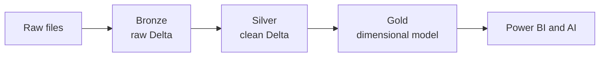

# Medallion Design

## Purpose

This page explains how Bronze, Silver, and Gold layers are used in this starter kit.

## Layer Responsibilities

| Layer | Purpose | Example Tables |
| --- | --- | --- |
| Bronze | Preserve raw source data with ingestion metadata | `brz_customers`, `brz_orders` |
| Silver | Clean, type, standardize, deduplicate, validate | `sil_customers`, `sil_order_items` |
| Gold | Publish business-ready models | `dim_customer`, `dim_product`, `fact_sales`, `customer_360` |

## Flow

## Best Practices

- Do not rewrite business rules into Bronze.
- Apply type casting and key validation in Silver.
- Define table grain before building facts.
- Use Gold for consistent metrics and BI-ready tables.
- Keep audit metadata through the layers where useful.

## Common Mistakes

| Mistake | Correction |
| --- | --- |
| Skipping Silver | Use Silver as the quality and standardization layer |
| Mixing raw and business-ready data | Keep clear layer boundaries |
| No table grain | Document fact grain before building measures |
| Too many Gold tables | Start with clear use cases and expand gradually |

## Checklist

- [ ] Bronze is raw and auditable.
- [ ] Silver applies consistent rules.
- [ ] Gold has business-friendly names and grain.
- [ ] DQ checks run before Gold publishing.

## Related Pages

- [Delta Lake](Delta-Lake)
- [Data Quality](Data-Quality)
- [Databricks Notebooks](Databricks-Notebooks)

