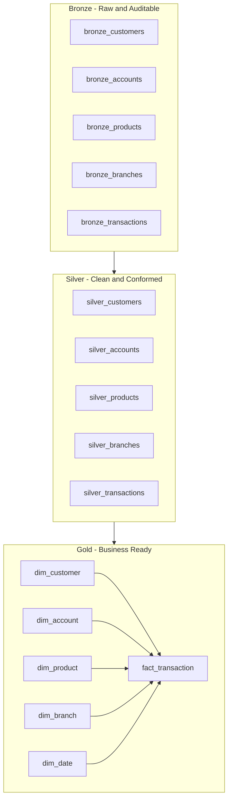
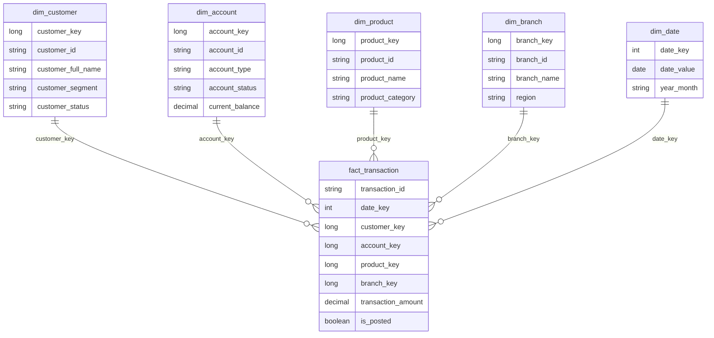
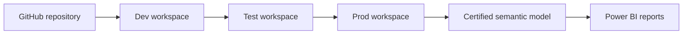

# Microsoft Fabric Data Engineering Blueprint

[](https://learn.microsoft.com/fabric/)
[](docs/02-fabric-data-engineering-concepts.md)
[](docs/05-medallion-architecture.md)
[](docs/04-onelake-explained.md)
[](notebooks/README.md)
[](adr/003-why-use-delta-tables.md)
[](semantic-model/README.md)
[](../CONTRIBUTING.md)

**A practical Microsoft Fabric Data Engineering blueprint for building real-world Lakehouse solutions from source files to Power BI.**

This repository is a complete, beginner-friendly, and enterprise-minded Microsoft Fabric Data Engineering learning project. It teaches **Lakehouse**, **OneLake**, **Data Pipelines**, **Fabric Notebooks**, **Spark**, **Medallion Architecture**, **Delta Tables**, **SQL Analytics Endpoint**, **Power BI consumption**, **data quality**, **governance**, **CI/CD**, and **real-world project structure** through an end-to-end **Retail Banking Customer Analytics** scenario.

This blueprint now lives inside a broader Microsoft learning repository. All paths in this README are relative to the `fabric-data-engineering-blueprint/` folder.

It is designed to be more than a tutorial. The goal is to provide a reusable open-source blueprint that learners, practitioners, architects, and teams can study, run, extend, and adapt for proof-of-concept work.

## Table of Contents

- [What This Repo Is](#what-this-repo-is)
- [Who This Repo Is For](#who-this-repo-is-for)
- [What You Will Learn](#what-you-will-learn)
- [Architecture Overview](#architecture-overview)
- [Medallion Architecture](#medallion-architecture)
- [Sample Business Scenario](#sample-business-scenario)
- [Dataset Overview](#dataset-overview)
- [Repository Structure](#repository-structure)
- [Quick Start Guide](#quick-start-guide)
- [Learning Modules](#learning-modules)
- [How To Run The Project](#how-to-run-the-project)
- [Expected Output](#expected-output)
- [Data Model Overview](#data-model-overview)
- [Power BI Consumption Guidance](#power-bi-consumption-guidance)
- [Governance And CI/CD Overview](#governance-and-cicd-overview)
- [Best Practices Included](#best-practices-included)
- [Common Mistakes Avoided](#common-mistakes-avoided)
- [Roadmap](#roadmap)
- [Contributing](#contributing)
- [Author And Community](#author-and-community)

## What This Repo Is

This repository is a practical implementation blueprint for Microsoft Fabric Data Engineering. It shows how to take source CSV files and turn them into a governed, business-ready analytics model.

The project flow is:

```text
Source CSV files
-> Fabric Data Pipeline
-> Lakehouse Files
-> Bronze Delta tables
-> Fabric Notebook transformations
-> Silver Delta tables
-> Gold dimensional model
-> SQL Analytics Endpoint views
-> Power BI semantic model
-> Business dashboards
```

The repo includes:

- Concept documentation for Fabric Data Engineering.
- Architecture diagrams and decision guides.
- Realistic Retail Banking sample data.
- Fabric-compatible PySpark notebooks.
- SQL scripts for analytics and validation.
- Data quality rules and a lightweight framework.
- Power BI semantic model guidance and DAX measures.
- Governance and PII handling guidance.
- CI/CD and deployment guidance.
- Architecture Decision Records.
- Interview preparation material.
- 30-day and 90-day learning plans.
- GitHub issue templates and contribution workflow.

## Who This Repo Is For

| Audience | How this repo helps |
| --- | --- |
| Beginners | Learn Fabric Data Engineering step by step through a realistic project. |
| Azure Data Engineers | Map ADF, ADLS, Synapse, and Databricks knowledge to Fabric patterns. |
| Power BI Developers | Understand Lakehouse engineering, Gold models, and semantic model design. |
| Students and Interview Candidates | Practice architecture explanations, hands-on tasks, and scenario questions. |
| Enterprise Teams | Use the structure as a first Fabric proof-of-concept foundation. |
| Architects | Review decision guides, governance models, CI/CD, and data product patterns. |
| Community Contributors | Extend notebooks, SQL, documentation, examples, and learning assets. |

## What You Will Learn

By working through this repository, you will learn how to:

- Explain what Microsoft Fabric is and where Data Engineering fits.
- Use OneLake and Lakehouse concepts correctly.
- Land raw files into Lakehouse Files.
- Build Bronze, Silver, and Gold layers using medallion architecture.
- Use Fabric Notebooks and PySpark for transformation.
- Write Delta tables for reliable analytical storage.
- Apply data quality rules before business consumption.
- Design a Gold star schema for Power BI.
- Expose business-friendly SQL views from the SQL Analytics Endpoint.
- Design Power BI semantic models with clear relationships and measures.
- Think about security, PII, access control, governance, CI/CD, and production readiness.
- Discuss Fabric architecture confidently in interviews and design reviews.

## Architecture Overview

```mermaid
flowchart LR
    source["Source CSV files"] --> pipeline["Fabric Data Pipeline<br/>copy and orchestration"]
    pipeline --> files["Lakehouse Files<br/>retail_banking/source"]
    files --> bronze["Bronze Delta tables<br/>raw and auditable"]
    bronze --> notebooks["Fabric Notebooks<br/>PySpark transformations"]
    notebooks --> silver["Silver Delta tables<br/>clean and conformed"]
    silver --> dq["Data Quality Gate<br/>rules and reconciliation"]
    dq --> gold["Gold Dimensional Model<br/>facts and dimensions"]
    gold --> sql["SQL Analytics Endpoint<br/>views and metrics"]
    sql --> semantic["Power BI Semantic Model<br/>relationships and measures"]
    semantic --> reports["Power BI Reports<br/>customer analytics"]

    classDef fabric fill:#742774,stroke:#4B155F,color:#ffffff;
    classDef storage fill:#0078D4,stroke:#004578,color:#ffffff;
    classDef quality fill:#107C10,stroke:#0B5A0B,color:#ffffff;
    classDef powerbi fill:#F2C811,stroke:#B38600,color:#111111;

    class pipeline,notebooks,sql fabric;
    class files,bronze,silver,gold storage;
    class dq quality;
    class semantic,reports powerbi;
```



## Medallion Architecture



## Sample Business Scenario

The sample project uses a **Retail Banking Customer Analytics** domain.

A retail banking analytics team wants to understand customers, accounts, products, branches, and transaction behavior. The team receives operational CSV extracts and needs to build a trusted analytics layer in Microsoft Fabric.

Business questions answered by this blueprint:

- How many active customers do we have?
- Which products are most used?
- What is transaction volume by month?
- Which branches have high transaction activity?
- What are the top customer segments?
- How do balances and transactions trend over time?
- Which customers, accounts, and products need deeper analysis?
- Which data quality issues should block reporting?

## Dataset Overview

The sample data is synthetic and intentionally small so beginners can inspect every row.

| File | Entity | Description |
| --- | --- | --- |
| `customers.csv` | Customer | Customer profile, segment, status, location, and sample PII fields. |
| `accounts.csv` | Account | Account ownership, product association, status, balance, and branch. |
| `products.csv` | Product | Banking product category, product family, fee model, and launch date. |
| `transactions.csv` | Transaction | Posted and rejected monetary events by account, product, branch, channel, and timestamp. |
| `branches.csv` | Branch | Branch name, city, state, region, open date, and active flag. |

Upload target in a Fabric Lakehouse:

```text
Files/retail_banking/source/
```

## Repository Structure

```text
fabric-data-engineering-blueprint/
|-- README.md
|-- LICENSE
|-- CONTRIBUTING.md
|-- CODE_OF_CONDUCT.md
|-- CHANGELOG.md
|-- .github/
|   |-- ISSUE_TEMPLATE/
|   +-- pull_request_template.md
|-- docs/
|   |-- 00-overview.md
|   |-- 01-what-is-microsoft-fabric.md
|   |-- 02-fabric-data-engineering-concepts.md
|   |-- 03-lakehouse-vs-warehouse.md
|   |-- 04-onelake-explained.md
|   |-- 05-medallion-architecture.md
|   |-- 06-data-pipeline-vs-notebook.md
|   |-- 07-sql-analytics-endpoint.md
|   |-- 08-power-bi-consumption.md
|   |-- 09-cicd-and-deployment.md
|   |-- 10-security-and-governance.md
|   |-- 11-best-practices.md
|   |-- 12-common-mistakes.md
|   |-- 13-cost-and-performance-considerations.md
|   |-- 14-fabric-for-azure-data-engineers.md
|   |-- 15-learning-resources.md
|   |-- 16-fabric-decision-guide.md
|   +-- 17-common-enterprise-mistakes.md
|-- architecture/
|   |-- fabric-end-to-end-architecture.md
|   |-- medallion-architecture.md
|   |-- data-product-architecture.md
|   |-- lakehouse-to-powerbi-flow.md
|   |-- cicd-flow.md
|   |-- governance-model.md
|   +-- real-world-architecture-patterns.md
|-- sample-data/
|   |-- customers.csv
|   |-- accounts.csv
|   |-- products.csv
|   |-- transactions.csv
|   +-- branches.csv
|-- notebooks/
|   |-- 00_setup_lakehouse.ipynb
|   |-- 01_bronze_ingestion.ipynb
|   |-- 02_silver_transformation.ipynb
|   |-- 03_gold_dimensional_model.ipynb
|   |-- 04_data_quality_checks.ipynb
|   |-- 05_delta_optimization.ipynb
|   |-- 06_powerbi_ready_views.ipynb
|   |-- 07_incremental_load_pattern.ipynb
|   +-- 08_operational_monitoring_examples.ipynb
|-- pipelines/
|   |-- pipeline_overview.md
|   |-- ingestion_pipeline_template.json
|   |-- transformation_pipeline_template.json
|   +-- orchestration_pattern.md
|-- sql/
|   |-- create_gold_views.sql
|   |-- business_metrics.sql
|   |-- validation_queries.sql
|   |-- powerbi_consumption_views.sql
|   |-- advanced_analytics_examples.sql
|   +-- operational_monitoring_examples.sql
|-- data-quality/
|   |-- dq_rules.yml
|   |-- dq_framework.py
|   |-- dq_examples.md
|   +-- dq_report_template.md
|-- semantic-model/
|   |-- semantic_model_design.md
|   |-- measures.md
|   |-- powerbi_model_guidelines.md
|   +-- business_glossary.md
|-- governance/
|-- cicd/
|-- adr/
|-- interview-guide/
|-- roadmap/
|-- checklists/
+-- community/
```

## Quick Start Guide

### Prerequisites

- Microsoft Fabric tenant with Fabric capacity or trial capacity enabled.
- Permission to create a Fabric Workspace, Lakehouse, Notebook, Data Pipeline, and Power BI semantic model.
- Basic familiarity with SQL and Python is helpful, but not required.
- Power BI web authoring or Power BI Desktop for report building.

### Step 1: Create Fabric Workspace

Create a workspace such as:

```text
fab-retailbank-dev
```

### Step 2: Create Lakehouse

Create a Lakehouse such as:

```text
lh_retailbank_dev
```

### Step 3: Upload Sample Data

Upload files from `sample-data/` into:

```text
Files/retail_banking/source/
```

### Step 4: Run Notebooks

Run the notebooks in order:

| Order | Notebook | Purpose |
| --- | --- | --- |
| 00 | `00_setup_lakehouse.ipynb` | Configure parameters, paths, and helper functions. |
| 01 | `01_bronze_ingestion.ipynb` | Read CSV files and create Bronze Delta tables. |
| 02 | `02_silver_transformation.ipynb` | Clean, type, deduplicate, and validate source data. |
| 03 | `03_gold_dimensional_model.ipynb` | Build dimensions and fact table. |
| 04 | `04_data_quality_checks.ipynb` | Run quality checks and produce pass/fail results. |
| 05 | `05_delta_optimization.ipynb` | Demonstrate Delta optimization patterns. |
| 06 | `06_powerbi_ready_views.ipynb` | Validate reporting-friendly shapes. |
| 07 | `07_incremental_load_pattern.ipynb` | Demonstrate a watermark-based incremental load pattern. |
| 08 | `08_operational_monitoring_examples.ipynb` | Demonstrate audit and monitoring examples. |

### Step 5: Run SQL Scripts

Run SQL scripts from the Lakehouse SQL Analytics Endpoint:

| Script | Purpose |
| --- | --- |
| `create_gold_views.sql` | Create business-friendly Gold views. |
| `business_metrics.sql` | Answer key retail banking business questions. |
| `validation_queries.sql` | Validate row counts, keys, and status values. |
| `powerbi_consumption_views.sql` | Create Power BI-ready reporting views. |
| `advanced_analytics_examples.sql` | Explore rankings, trends, and deeper analysis queries. |
| `operational_monitoring_examples.sql` | Review audit, freshness, and quality monitoring examples. |

### Step 6: Build Power BI Semantic Model

Use Gold tables or SQL views to create a semantic model with:

- `fact_transaction`
- `dim_customer`
- `dim_account`
- `dim_product`
- `dim_branch`
- `dim_date`

Then add measures from [semantic-model/measures.md](semantic-model/measures.md).

## Learning Modules

| Module | Folder or file | Outcome |
| --- | --- | --- |
| Fabric fundamentals | [docs/01-what-is-microsoft-fabric.md](docs/01-what-is-microsoft-fabric.md) | Understand the platform. |
| Data engineering concepts | [docs/02-fabric-data-engineering-concepts.md](docs/02-fabric-data-engineering-concepts.md) | Learn core Fabric Data Engineering terms. |
| Lakehouse decisions | [docs/03-lakehouse-vs-warehouse.md](docs/03-lakehouse-vs-warehouse.md) | Decide between Lakehouse and Warehouse. |
| OneLake | [docs/04-onelake-explained.md](docs/04-onelake-explained.md) | Understand Fabric storage. |
| Medallion architecture | [docs/05-medallion-architecture.md](docs/05-medallion-architecture.md) | Learn Bronze, Silver, Gold design. |
| Pipeline vs notebook | [docs/06-data-pipeline-vs-notebook.md](docs/06-data-pipeline-vs-notebook.md) | Separate orchestration from transformation. |
| SQL endpoint | [docs/07-sql-analytics-endpoint.md](docs/07-sql-analytics-endpoint.md) | Query Lakehouse tables with SQL. |
| Power BI | [semantic-model/](semantic-model/README.md) | Build a governed semantic model. |
| Data quality | [data-quality/](data-quality/README.md) | Add checks before business consumption. |
| Governance | [governance/](governance/README.md) | Apply access, PII, ownership, and standards. |
| CI/CD | [cicd/](cicd/README.md) | Plan Git and deployment workflow. |
| Decision guide | [docs/16-fabric-decision-guide.md](docs/16-fabric-decision-guide.md) | Compare common Fabric architecture choices. |
| Interview prep | [interview-guide/](interview-guide/README.md) | Practice questions and scenarios. |

## How To Run The Project

Follow this execution flow:

```text
1. Upload sample data
2. Run setup notebook
3. Run Bronze ingestion notebook
4. Run Silver transformation notebook
5. Run Gold dimensional model notebook
6. Run data quality notebook
7. Run SQL view scripts
8. Build Power BI semantic model
9. Create dashboard pages
10. Review governance, CI/CD, and production checklist
```

Recommended validation after each major step:

| Step | Validation |
| --- | --- |
| Source upload | All five CSV files exist in Lakehouse Files. |
| Bronze | Row counts match source files and metadata columns exist. |
| Silver | Data types are correct, duplicates are removed, and keys are valid. |
| Gold | Dimensions and fact table join correctly. |
| Data quality | Critical rules pass before reporting. |
| SQL endpoint | Views return expected rows and business-friendly names. |
| Power BI | Relationships work and measures return expected values. |

## Expected Output

After completing the project, you should have:

### Lakehouse Tables

Bronze tables:

- `bronze_customers`
- `bronze_accounts`
- `bronze_products`
- `bronze_branches`
- `bronze_transactions`

Silver tables:

- `silver_customers`
- `silver_accounts`
- `silver_products`
- `silver_branches`
- `silver_transactions`

Gold tables:

- `dim_customer`
- `dim_account`
- `dim_product`
- `dim_branch`
- `dim_date`
- `fact_transaction`

### SQL Views And Queries

- Gold dimension and fact views.
- Power BI-ready transaction detail view.
- Monthly transaction summary view.
- Customer account summary view.
- Business metric queries.
- Validation queries.
- Advanced analytics examples.
- Operational monitoring examples.

### Power BI Assets

Recommended report pages:

1. Executive Overview
2. Customer Segment Analysis
3. Product Usage
4. Branch Activity
5. Transaction Trends
6. Account and Customer Deep Dive
7. Data Quality and Freshness Summary

## Data Model Overview

The Gold layer follows a star schema:



## Power BI Consumption Guidance

Use the Gold layer for Power BI. Avoid building reports directly on Bronze or raw files.

Recommended semantic model design:

- Use `fact_transaction` as the central fact table.
- Use dimensions for customer, account, product, branch, and date.
- Create one-to-many relationships from dimensions to the fact.
- Use single-direction filtering unless there is a documented reason.
- Hide surrogate key columns from report view after relationships are created.
- Define measures once in the semantic model.
- Use business-friendly names and descriptions.
- Document Direct Lake vs Import mode decision.

Example measures included:

- Total Transaction Amount
- Transaction Count
- Posted Transaction Count
- Active Customer Count
- Average Transaction Amount
- Account Count
- Open Account Count
- Customer Segment Count
- Total Current Balance

See [semantic-model/measures.md](semantic-model/measures.md).

## Governance And CI/CD Overview

This blueprint includes production-minded guidance for governance and release management.

### Governance

Covered in [governance/](governance/README.md):

- Role-based access model.
- Bronze, Silver, and Gold access patterns.
- Data owner and data steward responsibilities.
- PII classification and handling.
- Naming standards.
- Data classification checklist.
- Production governance checklist.

### CI/CD

Covered in [cicd/](cicd/README.md):

- Git integration concept.
- Deployment pipeline concept.
- Dev/Test/Prod workspace strategy.
- Environment-specific configuration.
- Release checklist.
- What should and should not be version-controlled.
- Common CI/CD mistakes in Fabric projects.

Recommended environment pattern:



## Best Practices Included

- Use medallion architecture for clear data quality progression.
- Preserve raw data and ingestion metadata in Bronze.
- Clean, type, standardize, and validate data in Silver.
- Publish facts and dimensions in Gold.
- Apply data quality checks before business consumption.
- Use SQL views for business-friendly consumption.
- Use a star schema for Power BI semantic models.
- Keep PII out of broad reporting views.
- Use least privilege access by layer.
- Document architecture decisions with ADRs.
- Separate Dev, Test, and Prod workspaces.
- Version notebooks, SQL, pipeline templates, data quality rules, and documentation.
- Use checklists before production release.

## Common Mistakes Avoided

This repository is designed to help teams avoid common Fabric implementation mistakes:

- Reporting directly on raw files.
- Skipping the Silver layer.
- Treating pipelines and notebooks as the same thing.
- Putting complex transformation logic into visual pipeline activities.
- Building a semantic model without a star schema.
- Creating many disconnected Power BI models with different metric logic.
- Publishing PII into shared reporting views.
- Ignoring data quality until users find problems.
- Hardcoding environment-specific values.
- Editing production manually without release control.
- Treating a successful pipeline run as proof that the data is correct.

See [docs/17-common-enterprise-mistakes.md](docs/17-common-enterprise-mistakes.md).

## Roadmap

### Current

- End-to-end Retail Banking Customer Analytics project.
- Sample data, notebooks, SQL, data quality, governance, CI/CD, semantic model guidance.
- Decision guides and architecture patterns.
- 30-day and 90-day learning plans.
- GitHub issue and pull request templates.

### Planned Enhancements

- Larger synthetic data generator.
- Incremental load production pattern with pipeline parameters.
- Dataflow Gen2 example.
- Power BI report template.
- Monitoring dashboard template.
- Fabric API deployment notes.
- More architecture decision records.
- Additional industry domains such as healthcare, insurance, and retail sales.

## Contributing

Contributions are welcome when they improve clarity, correctness, practical usefulness, or enterprise readiness.

Good contribution areas:

- Add new Fabric implementation examples.
- Improve PySpark notebooks.
- Add SQL analytics examples.
- Add data quality rules.
- Improve governance or CI/CD guidance.
- Add Power BI semantic model examples.
- Add interview questions or hands-on labs.
- Add architecture decision records.
- Improve beginner explanations.

Start here:

- [CONTRIBUTING.md](../CONTRIBUTING.md)
- [CODE_OF_CONDUCT.md](../CODE_OF_CONDUCT.md)
- [community/README.md](community/README.md)
- [community/contribution-tracker-template.md](community/contribution-tracker-template.md)

## Author And Community

This repository is built for the Microsoft Fabric and data engineering community.

Use it as:

- A beginner learning guide.
- A Fabric proof-of-concept starter.
- A Microsoft Fabric architecture reference.
- A portfolio project.
- A meetup or YouTube demo foundation.
- A technical blogging series foundation.
- An interview preparation resource.
- A contribution-friendly open-source project.

If this project helps you learn or explain Microsoft Fabric Data Engineering, consider starring the repo, sharing it with other learners, and contributing improvements.

## Professional Closing Note

Microsoft Fabric is most valuable when teams combine fast analytics delivery with disciplined engineering practices. This blueprint is designed to help you do both: learn the platform step by step, while building habits around architecture, data quality, governance, semantic modeling, and production readiness.

Build it once as a learning project. Then adapt it into the standard your future Fabric projects deserve.
