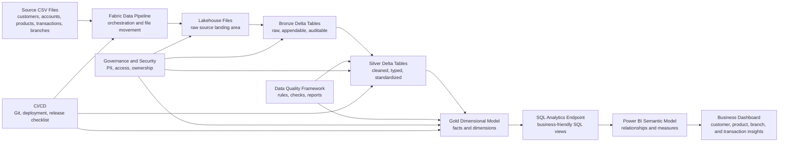

# Microsoft Data & AI Learning Blueprints Wiki

> A practical learning portal for Microsoft Fabric, Power BI, Azure Data, AI, governance, CI/CD, and real-world analytics engineering projects.

Welcome to the Wiki for **microsoft-data-ai-learning-blueprints**. This repository is organized as a collection of hands-on Microsoft Data and AI learning blueprints. Each major topic lives in its own folder, while this Wiki acts as the learning portal, implementation handbook, and community knowledge base.

The first active blueprint is **Microsoft Fabric Data Engineering**, built around a realistic **Retail Banking Customer Analytics** scenario. It teaches how raw CSV files become trusted, governed, business-ready analytics assets using Microsoft Fabric Lakehouse, OneLake, Data Pipelines, Notebooks, PySpark, Delta tables, SQL Analytics Endpoint, and Power BI.

## Repository Tagline

**Practical Microsoft Data and AI learning blueprints for Fabric, Power BI, Azure Data, governance, CI/CD, and enterprise analytics engineering.**

## What This Wiki Is

This Wiki is the detailed learning companion for the repository. The root README explains the overall repo structure. This Wiki helps learners and practitioners understand the concepts, run the examples, compare architecture choices, and prepare for real implementation conversations.

| Area | What This Wiki Helps You Do |
| --- | --- |
| Learning | Understand Microsoft data and analytics concepts through guided paths |
| Implementation | Run real examples from source data to curated analytics outputs |
| Architecture | Compare platform choices, design patterns, governance models, and CI/CD approaches |
| Career growth | Prepare for interviews, portfolio demos, blog posts, and community sessions |
| Community | Contribute new topics, examples, corrections, and practical implementation notes |

## Current Blueprint Catalog

| Blueprint | Folder | Status | What It Teaches |
| --- | --- | --- | --- |
| Microsoft Fabric Data Engineering Blueprint | [fabric-data-engineering-blueprint](https://github.com/ravikiranpagidi/microsoft-data-ai-learning-blueprints/tree/main/fabric-data-engineering-blueprint) | Active | Lakehouse, OneLake, pipelines, notebooks, Spark, Delta, medallion architecture, SQL endpoint, Power BI, governance, and CI/CD |

## Future Blueprint Ideas

These are natural next folders for the repository:

| Future Topic | Possible Folder | Learning Focus |
| --- | --- | --- |
| Power BI Semantic Modeling | `power-bi-semantic-modeling-blueprint/` | Star schema, DAX, calculation groups, Direct Lake, deployment, governance |
| Azure Data Engineering | `azure-data-engineering-blueprint/` | ADF, ADLS Gen2, Synapse, Databricks, orchestration, lake patterns |
| Microsoft Purview Governance | `microsoft-purview-governance-blueprint/` | Catalog, lineage, classification, ownership, glossary, policy |
| Fabric Real-Time Intelligence | `fabric-real-time-intelligence-blueprint/` | Eventstreams, KQL databases, real-time dashboards, operational analytics |
| AI-Ready Data Engineering | `azure-ai-data-blueprint/` | Data preparation for AI, vector search, RAG pipelines, evaluation data |

## Who This Wiki Is For

| Audience | Why This Wiki Helps |
| --- | --- |
| Beginners | Learn Microsoft data platforms through practical examples instead of abstract definitions |
| Azure Data Engineers | Map ADF, Synapse, ADLS, Databricks, and SQL experience into Fabric and modern analytics patterns |
| Power BI Developers | Understand how curated engineering layers support reliable semantic models and dashboards |
| Data Architects | Review platform, governance, medallion, data product, and deployment patterns |
| Students and Interview Candidates | Build practical project evidence and scenario-based answers |
| Enterprise Teams | Use the blueprints as proof-of-concept starters and implementation checklists |
| Community Contributors | Add new topics, better examples, diagrams, issue fixes, and learning content |

## Recommended Learning Paths

### 1. Microsoft Fabric Beginner Path

Best for learners who are new to Fabric or modern lakehouse engineering.

1. [Getting Started](Getting-Started)
2. [Microsoft Fabric Fundamentals](Microsoft-Fabric-Fundamentals)
3. [OneLake Explained](OneLake-Explained)
4. [Lakehouse Concepts](Lakehouse-Concepts)
5. [Files vs Tables in Fabric Lakehouse](Files-vs-Tables-in-Fabric-Lakehouse)
6. [Medallion Architecture](Medallion-Architecture)
7. [30-Day Learning Plan](30-Day-Learning-Plan)

Outcome: You can explain Fabric basics and run the first blueprint from raw files to curated Lakehouse tables.

### 2. Azure Data Engineer Transition Path

Best for data engineers moving from Azure Data Factory, Synapse, ADLS Gen2, Databricks, or SQL-based platforms.

1. [Fabric Data Engineering Overview](Fabric-Data-Engineering-Overview)
2. [Lakehouse vs Warehouse](Lakehouse-vs-Warehouse)
3. [Data Pipelines vs Notebooks](Data-Pipelines-vs-Notebooks)
4. [Dataflow Gen2 vs Notebook vs Pipeline](Dataflow-Gen2-vs-Notebook-vs-Pipeline)
5. [Fabric Decision Guide](Fabric-Decision-Guide)
6. [CI/CD and Deployment Strategy](CICD-and-Deployment-Strategy)
7. [90-Day Professional Growth Plan](90-Day-Professional-Growth-Plan)

Outcome: You can translate familiar Azure data patterns into Microsoft Fabric choices.

### 3. Power BI Developer Path

Best for BI developers who want to understand how engineered Lakehouse data becomes a governed semantic model.

1. [Gold Layer Design](Gold-Layer-Design)
2. [Dimensional Modeling in Fabric](Dimensional-Modeling-in-Fabric)
3. [Building Dimensions and Facts](Building-Dimensions-and-Facts)
4. [SQL Analytics Endpoint Guide](SQL-Analytics-Endpoint-Guide)
5. [Power BI Consumption Guide](Power-BI-Consumption-Guide)
6. [Semantic Model Design](Semantic-Model-Design)

Outcome: You can explain why Power BI should consume curated Gold data instead of raw files or ad hoc transformations.

### 4. Data Architect Path

Best for architects, platform owners, and technical leads.

1. [Real-World Architecture Patterns](Real-World-Architecture-Patterns)
2. [Fabric Decision Guide](Fabric-Decision-Guide)
3. [Governance and Security](Governance-and-Security)
4. [Access Control Model](Access-Control-Model)
5. [PII and Sensitive Data Handling](PII-and-Sensitive-Data-Handling)
6. [Architecture Decision Records Guide](Architecture-Decision-Records-Guide)
7. [Performance and Optimization](Performance-and-Optimization)

Outcome: You can evaluate a Microsoft Fabric proof of concept for architecture quality, governance, performance, and production readiness.

### 5. Interview Preparation Path

Best for students, job seekers, and professionals preparing for data engineering, Fabric, or analytics engineering interviews.

1. [Glossary](Glossary)
2. [FAQ](FAQ)
3. [Common Mistakes and How to Avoid Them](Common-Mistakes-and-How-to-Avoid-Them)
4. [Fabric Decision Guide](Fabric-Decision-Guide)
5. [Interview Preparation Guide](Interview-Preparation-Guide)
6. [Retail Banking Sample Domain](Retail-Banking-Sample-Domain)
7. [Building Dimensions and Facts](Building-Dimensions-and-Facts)

Outcome: You can answer conceptual, hands-on, and architecture questions with examples from a real blueprint.

## Complete Wiki Navigation

| # | Page | Use This Page To |
| ---: | --- | --- |
| 1 | [Home](Home) | Choose a learning path and understand the repository direction |
| 2 | [Getting Started](Getting-Started) | Set up Fabric, upload data, run notebooks, and validate outputs |
| 3 | [Microsoft Fabric Fundamentals](Microsoft-Fabric-Fundamentals) | Understand Fabric workloads and platform concepts |
| 4 | [Fabric Data Engineering Overview](Fabric-Data-Engineering-Overview) | Learn how Lakehouse, notebooks, Spark, pipelines, and SQL endpoint work together |
| 5 | [OneLake Explained](OneLake-Explained) | Understand OneLake, shortcuts, workspaces, Files, and Tables |
| 6 | [Lakehouse Concepts](Lakehouse-Concepts) | Learn Lakehouse storage, metadata, Delta, Spark, SQL, and Power BI access |
| 7 | [Lakehouse vs Warehouse](Lakehouse-vs-Warehouse) | Decide between Fabric Lakehouse and Warehouse |
| 8 | [Files vs Tables in Fabric Lakehouse](Files-vs-Tables-in-Fabric-Lakehouse) | Know when to use raw files versus managed Delta tables |
| 9 | [Data Pipelines vs Notebooks](Data-Pipelines-vs-Notebooks) | Decide between orchestration and code-based transformation |
| 10 | [Dataflow Gen2 vs Notebook vs Pipeline](Dataflow-Gen2-vs-Notebook-vs-Pipeline) | Choose the right transformation and orchestration tool |
| 11 | [End-to-End Project Walkthrough](End-to-End-Project-Walkthrough) | Follow the complete Retail Banking implementation flow |
| 12 | [Retail Banking Sample Domain](Retail-Banking-Sample-Domain) | Understand customers, accounts, products, transactions, branches, and dates |
| 13 | [Sample Dataset Guide](Sample-Dataset-Guide) | Learn each CSV file, key columns, relationships, and quality expectations |
| 14 | [Medallion Architecture](Medallion-Architecture) | Understand Bronze, Silver, and Gold design principles |
| 15 | [Bronze Layer Design](Bronze-Layer-Design) | Design raw, auditable ingestion tables |
| 16 | [Silver Layer Design](Silver-Layer-Design) | Clean, standardize, deduplicate, and validate data |
| 17 | [Gold Layer Design](Gold-Layer-Design) | Build business-ready facts, dimensions, and consumption views |
| 18 | [Dimensional Modeling in Fabric](Dimensional-Modeling-in-Fabric) | Learn star schema, facts, dimensions, keys, and grain |
| 19 | [Building Dimensions and Facts](Building-Dimensions-and-Facts) | Build dimensions and facts for Retail Banking analytics |
| 20 | [SQL Analytics Endpoint Guide](SQL-Analytics-Endpoint-Guide) | Query Lakehouse tables and create SQL views for consumers |
| 21 | [Power BI Consumption Guide](Power-BI-Consumption-Guide) | Connect Power BI to Fabric and consume Gold data responsibly |
| 22 | [Semantic Model Design](Semantic-Model-Design) | Define measures, relationships, naming, glossary, and metric standards |
| 23 | [Data Quality Framework](Data-Quality-Framework) | Use rule-driven checks before business consumption |
| 24 | [Governance and Security](Governance-and-Security) | Apply ownership, stewardship, least privilege, and auditability |
| 25 | [Access Control Model](Access-Control-Model) | Design roles and access by Bronze, Silver, and Gold layers |
| 26 | [PII and Sensitive Data Handling](PII-and-Sensitive-Data-Handling) | Identify and protect sensitive banking data |
| 27 | [Naming Standards](Naming-Standards) | Apply clear names for workspaces, lakehouses, notebooks, pipelines, tables, columns, and views |
| 28 | [CI/CD and Deployment Strategy](CICD-and-Deployment-Strategy) | Plan Git integration, deployment pipelines, promotion, and releases |
| 29 | [Dev/Test/Prod Workspace Strategy](Dev-Test-Prod-Workspace-Strategy) | Separate environments and promote Fabric assets safely |
| 30 | [Performance and Optimization](Performance-and-Optimization) | Improve Delta, Spark, SQL, and Power BI performance |
| 31 | [Common Mistakes and How to Avoid Them](Common-Mistakes-and-How-to-Avoid-Them) | Avoid beginner and enterprise implementation issues |
| 32 | [Architecture Decision Records Guide](Architecture-Decision-Records-Guide) | Capture architecture choices with ADRs |
| 33 | [Fabric Decision Guide](Fabric-Decision-Guide) | Use decision matrices for common Fabric architecture choices |
| 34 | [Real-World Architecture Patterns](Real-World-Architecture-Patterns) | Compare small team, enterprise, data product, self-service BI, AI-ready, and regulated patterns |
| 35 | [Interview Preparation Guide](Interview-Preparation-Guide) | Practice beginner, intermediate, scenario, and architecture interview answers |
| 36 | [30-Day Learning Plan](30-Day-Learning-Plan) | Follow a beginner-friendly month-long learning plan |
| 37 | [90-Day Professional Growth Plan](90-Day-Professional-Growth-Plan) | Build professional Fabric Data Engineering capability over three months |
| 38 | [Contributor Guide](Contributor-Guide) | Learn how to improve the repo and Wiki |
| 39 | [FAQ](FAQ) | Find answers to common Fabric and project questions |
| 40 | [Glossary](Glossary) | Learn key Microsoft Fabric, lakehouse, modeling, governance, and CI/CD terms |

## Active Blueprint Architecture

The current Fabric blueprint follows this practical source-to-dashboard flow:

## Retail Banking Customer Analytics Scenario

The active Fabric blueprint uses Retail Banking because it has familiar entities and realistic analytics questions.

| Entity | Business Meaning | Example Questions |
| --- | --- | --- |
| Customer | A person or organization that holds banking products | How many active customers do we have? What segments are growing? |
| Account | A banking account owned by a customer | Which accounts have high balances or high activity? |
| Product | A banking product such as checking, savings, credit card, or loan | Which products are most used? |
| Transaction | A financial activity on an account | What is transaction volume by month? What are transaction trends? |
| Branch | A physical or organizational banking location | Which branches have high transaction activity? |
| Date | A reusable calendar dimension | How do balances and transactions trend over time? |

## Quick Start

1. Open the main repository: [microsoft-data-ai-learning-blueprints](https://github.com/ravikiranpagidi/microsoft-data-ai-learning-blueprints).
2. Open the active topic folder: [fabric-data-engineering-blueprint](https://github.com/ravikiranpagidi/microsoft-data-ai-learning-blueprints/tree/main/fabric-data-engineering-blueprint).
3. Review the sample data in [sample-data](https://github.com/ravikiranpagidi/microsoft-data-ai-learning-blueprints/tree/main/fabric-data-engineering-blueprint/sample-data).
4. Create a Microsoft Fabric workspace and Lakehouse.
5. Upload the CSV files into the Lakehouse Files area.
6. Run notebooks in order from [notebooks](https://github.com/ravikiranpagidi/microsoft-data-ai-learning-blueprints/tree/main/fabric-data-engineering-blueprint/notebooks).
7. Run SQL scripts from [sql](https://github.com/ravikiranpagidi/microsoft-data-ai-learning-blueprints/tree/main/fabric-data-engineering-blueprint/sql) through the SQL Analytics Endpoint.
8. Review Power BI, governance, CI/CD, and interview preparation guidance.

## Contribution Invitation

This repository is intended to grow into a serious Microsoft Data and AI learning collection. Contributions are welcome when they improve clarity, hands-on usefulness, architecture quality, enterprise readiness, or community learning value.

Useful contributions include:

- New Microsoft Data and AI learning blueprint folders.
- Better explanations for beginners.
- More Fabric, Power BI, Azure Data, Purview, or AI examples.
- Additional notebooks, SQL scripts, DAX measures, KQL queries, or pipeline templates.
- Better governance, CI/CD, security, and monitoring guidance.
- Interview questions, hands-on practice tasks, and portfolio examples.
- Broken link fixes, typo fixes, and navigation improvements.

Start with the [Contributor Guide](Contributor-Guide).

## Summary Checklist

- [ ] I understand that this is now a Microsoft Data and AI learning hub.
- [ ] I know that Fabric Data Engineering is the first active blueprint.
- [ ] I know where the active topic folder lives in the main repository.
- [ ] I selected a learning path that matches my background.
- [ ] I know which Wiki page to read next.

---

## Page Navigation

| Previous | Home | Next |
| --- | --- | --- |
| Start here | [Home](Home) | [Getting Started](Getting-Started) |

Helpful references: [FAQ](FAQ) | [Glossary](Glossary) | [Contributor Guide](Contributor-Guide)
