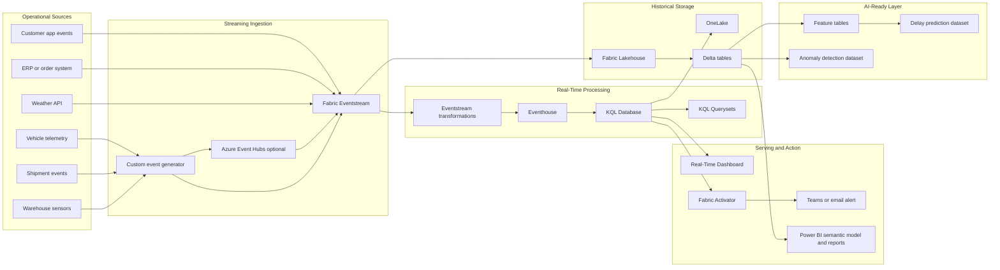

# Microsoft Fabric Real-Time Intelligence Blueprint

[](https://learn.microsoft.com/fabric/real-time-intelligence/)
[](docs/eventstream-design.md)
[](docs/eventhouse-kql.md)
[](kql/realtime_queries.kql)
[](powerbi/report-layout.md)
[](../CONTRIBUTING.md)

> An end-to-end Microsoft Fabric Real-Time Intelligence blueprint for ingesting, processing, analyzing, visualizing, and acting on streaming operational data.

This blueprint shows how to design and demonstrate a real-time operations monitoring platform on Microsoft Fabric. It uses a fictional **Smart Logistics and Operations Monitoring** scenario with events from delivery vehicles, shipment systems, warehouse sensors, customer applications, order systems, and external weather feeds.

The goal is not to create a small sample. The goal is to provide a practical, implementation-ready learning asset that explains the architecture, gives runnable sample code, includes KQL queries, defines alert scenarios, and shows how real-time analytics connects to Lakehouse, Power BI, governance, and AI-ready datasets.

## Why This Blueprint Exists

Many real-time examples stop at "send events and show a chart." Real projects need more than that. Teams need to understand how to route events, store operational history, query with KQL, trigger alerts, control access, monitor costs, and explain the design to stakeholders.

This blueprint helps you answer:

- How should Fabric Eventstream, Eventhouse, KQL database, Lakehouse, Power BI, and Activator work together?
- What event schemas are useful for logistics and operational monitoring?
- Which KQL queries support live dashboards and alert rules?
- When should data stay in Eventhouse and when should it land in Lakehouse?
- How can real-time data become useful for historical reporting and AI features?
- What should architects think about before moving a real-time proof of concept toward production?

## Who Should Use This Blueprint

| Audience | How This Helps |
| --- | --- |
| Data engineers | Build a working event generator, KQL tables, ingestion patterns, and Lakehouse landing design. |
| Analytics engineers | Model operational events into clean summary tables and dashboard-ready outputs. |
| BI developers | Understand how real-time dashboards and Power BI reports complement each other. |
| Cloud architects | Review the end-to-end Fabric architecture and enterprise trade-offs. |
| Fabric practitioners | Practice Eventstream, Eventhouse, KQL, Activator, and Real-Time Dashboard patterns. |
| Students and interview candidates | Use a realistic scenario to explain real-time analytics design decisions. |
| Engineering managers | See how a real-time monitoring proof of concept can be scoped and demonstrated. |

## What Makes This Different From A Basic Demo

- It uses a realistic logistics operations scenario instead of generic device messages.
- It includes event schemas, sample events, generator code, KQL scripts, alert rules, Lakehouse tables, and Power BI design notes.
- It separates real-time query needs from historical analytics needs.
- It explains governance, cost, troubleshooting, and operational readiness.
- It can support a meetup session, conference demo, portfolio review, or enterprise proof of concept discussion.

## Architecture Overview



## Business Scenario

Contoso Logistics wants to monitor delivery operations in near real time. Vehicles send telemetry every few seconds. Shipment systems publish status changes. Warehouse sensors emit temperature, humidity, vibration, and door events. Customer applications and order systems provide additional operational context.

The operations team needs to know:

- Which shipments are currently delayed?
- Which routes are creating repeated SLA problems?
- Which vehicles show health or safety concerns?
- Which warehouse zones are outside allowed temperature ranges?
- Which regions have the highest delay rate today?
- Which patterns should be stored for historical reporting and future delay prediction?

## Features

- Smart logistics event generator with local JSON output and optional Azure Event Hubs publishing.
- JSON schemas for shipment, vehicle telemetry, and warehouse sensor events.
- KQL scripts for table creation, mappings, real-time queries, dashboard tiles, and alert conditions.
- Lakehouse Bronze, Silver, and Gold table designs for historical analytics.
- Power BI semantic model notes, DAX measures, and report layout guidance.
- Fabric Activator alert scenarios with business meaning, trigger conditions, and response actions.
- Excalidraw-friendly diagram specifications and placeholder `.excalidraw` files.
- Wiki pages for learning, setup, architecture, KQL, Lakehouse, Power BI, governance, troubleshooting, and roadmap.
- Demo script for a 10 to 15 minute technical presentation.

## Technology Stack

| Area | Technology |
| --- | --- |
| Streaming ingestion | Microsoft Fabric Eventstream, optional Azure Event Hubs |
| Real-time storage and query | Eventhouse, KQL Database, KQL Queryset |
| Visualization | Real-Time Dashboard, Power BI |
| Alerting | Fabric Activator |
| Historical analytics | OneLake, Fabric Lakehouse, Delta tables |
| Sample generation | Python |
| Query language | KQL, SQL, DAX |
| Governance | Fabric workspace roles, sensitivity labels, lineage, Purview-oriented operating model |

## Repository Structure

```text
fabric-real-time-intelligence-blueprint/
|-- README.md
|-- LICENSE
|-- CONTRIBUTING.md
|-- docs/
|-- diagrams/
|-- src/event-generator/
|-- schemas/
|-- kql/
|-- lakehouse/
|-- powerbi/
|-- samples/
|-- tests/
`-- wiki/
```

## Quick Start

1. Open `src/event-generator/`.
2. Create a virtual environment if you want to run locally.
3. Install dependencies from `requirements.txt`.
4. Copy `config.example.json` to `config.local.json`.
5. Run the generator in local file mode.
6. Review generated events in `samples/generated-events.jsonl`.
7. Create an Eventhouse and KQL database in Fabric.
8. Run scripts from `kql/create_tables.kql` and `kql/ingestion_mapping.kql`.
9. Use `kql/realtime_queries.kql` and `kql/dashboard_queries.kql` for query practice.
10. Review `docs/data-activator-alerts.md` for alert design.

```powershell
cd fabric-real-time-intelligence-blueprint/src/event-generator
python -m venv .venv
.\\.venv\\Scripts\\Activate.ps1
pip install -r requirements.txt
python generate_events.py --config config.example.json --count 100 --output ../../samples/generated-events.jsonl
```

## Prerequisites

- Microsoft Fabric workspace backed by capacity.
- Access to Real-Time Intelligence items such as Eventstream, Eventhouse, KQL database, Queryset, Real-Time Dashboard, and Activator.
- Python 3.10 or later for local event generation.
- Optional Azure Event Hubs namespace and event hub if you want to publish to Event Hubs first.
- Power BI knowledge for report and semantic model extension.

## Demo Flow

1. Explain the logistics operations problem.
2. Show the architecture diagram.
3. Run the Python event generator.
4. Send events to local file, Event Hubs, or Eventstream.
5. Create Eventhouse tables and ingestion mappings.
6. Query shipment delays, telemetry anomalies, and warehouse breaches with KQL.
7. Build Real-Time Dashboard tiles from KQL queries.
8. Configure Activator rules for delay and temperature alerts.
9. Persist selected streams to Lakehouse tables.
10. Explain Power BI and AI-ready extensions.

## Sample Event Schema

Shipment events include identifiers, route context, planned delivery time, current ETA, status, delay, temperature requirement, and event timestamp.

```json
{
  "shipment_id": "SHP-100045",
  "order_id": "ORD-900120",
  "vehicle_id": "VH-204",
  "driver_id": "DRV-018",
  "customer_region": "Midwest",
  "origin": "Chicago DC",
  "destination": "Madison Store 12",
  "planned_delivery_time": "2026-06-17T15:30:00Z",
  "current_eta": "2026-06-17T16:05:00Z",
  "shipment_status": "InTransit",
  "delay_minutes": 35,
  "temperature_required": true,
  "event_timestamp": "2026-06-17T14:12:10Z"
}
```

See the full schemas in [schemas](schemas/).

## Real-Time Dashboard Examples

Recommended dashboard tiles:

- Current delayed shipments.
- Shipments by status.
- Average delay by region.
- SLA breach candidates.
- Vehicle telemetry anomaly count.
- Warehouse temperature breaches.
- Event volume by minute.
- Map of active vehicles by latest location.

Queries are provided in [kql/dashboard_queries.kql](kql/dashboard_queries.kql).

## Fabric Activator Alert Examples

Recommended alerts:

- Shipment delay exceeds 30 minutes.
- SLA breach risk is high.
- Vehicle engine temperature exceeds threshold.
- Warehouse temperature exceeds allowed range.
- No telemetry received for a vehicle in 10 minutes.
- Repeated delay on the same route.

Details are in [docs/data-activator-alerts.md](docs/data-activator-alerts.md).

## Lakehouse Integration

Eventhouse is optimized for high-volume time-series and operational queries. Lakehouse is used for durable historical analytics, curated Delta tables, Power BI reporting, and AI feature creation.

This blueprint proposes:

- Bronze raw event tables.
- Silver cleaned operational tables.
- Gold aggregate and summary tables.
- AI-ready feature tables for delay prediction and anomaly detection.

See [docs/lakehouse-design.md](docs/lakehouse-design.md) and [lakehouse](lakehouse/).

## Power BI Reporting Layer

Power BI should consume curated Gold tables or business-ready views, not raw event streams. This keeps reporting stable and makes metrics easier to govern.

Suggested report pages:

- Executive Operations Overview.
- Real-Time Shipment Monitoring.
- Delay and SLA Analysis.
- Vehicle Health.
- Warehouse Conditions.
- Regional Performance.

See [powerbi/report-layout.md](powerbi/report-layout.md) and [powerbi/measures.dax](powerbi/measures.dax).

## AI-Ready Extensions

Possible extensions:

- Delay prediction feature table using route, region, weather, historical delay, and telemetry features.
- Vehicle anomaly detection dataset using speed, engine temperature, harsh braking, and route profile.
- Warehouse risk scoring using temperature, humidity, door-open state, and duration outside safe range.
- Event summarization table for Copilot or agentic analytics scenarios.

## Security And Governance

Use least privilege access by item and persona:

- Data engineers manage Eventstream, Eventhouse, and Lakehouse ingestion.
- Operations analysts use dashboards and approved querysets.
- BI developers build semantic models from curated outputs.
- Business users consume reports and approved alerts.
- Platform owners manage capacity, workspace roles, labels, lineage, and monitoring.

Do not store secrets in code. Use environment variables, Key Vault-backed processes, or managed connections where appropriate.

## Cost Considerations

Cost and capacity usage depend on ingestion volume, query frequency, dashboard refresh patterns, retention, Eventhouse compute, Lakehouse storage, Power BI usage, and alert rule volume.

Practical controls:

- Start with small event rates for demos.
- Define retention policies for high-volume raw events.
- Separate high-frequency dashboard queries from long-running analysis queries.
- Use summary tables for Power BI where possible.
- Monitor Eventhouse and Fabric capacity usage during load tests.

## Limitations

- This repo does not provision Fabric items automatically.
- Eventstream configuration is documented, not exported as a fully deployable artifact.
- Activator alert creation requires manual setup in Fabric.
- Sample data is fictional and intentionally small.
- KQL scripts may need minor adjustments based on workspace naming and ingestion destination choices.

## Roadmap

| Version | Focus |
| --- | --- |
| v1 | Event generator, schemas, Eventstream design, Eventhouse KQL scripts, dashboard queries, basic alert rules |
| v2 | Lakehouse integration, Power BI semantic model guidance, more industry scenarios, CI/CD improvements |
| v3 | AI-ready feature tables, predictive delay model, anomaly detection, Copilot or agentic analytics extension |

## Useful Microsoft References

- [Fabric Real-Time Intelligence documentation](https://learn.microsoft.com/en-us/fabric/real-time-intelligence/)
- [Eventstreams overview](https://learn.microsoft.com/en-us/fabric/real-time-intelligence/event-streams/overview)
- [Eventhouse overview](https://learn.microsoft.com/en-us/fabric/real-time-intelligence/eventhouse)
- [Create a Real-Time Dashboard](https://learn.microsoft.com/en-us/fabric/real-time-intelligence/dashboard-real-time-create)
- [Fabric Activator overview](https://learn.microsoft.com/en-us/fabric/real-time-intelligence/data-activator/activator-introduction)

## Contributing

Contributions are welcome. Good additions include new KQL queries, event generator improvements, additional industry scenarios, dashboard screenshots, Activator rules, Lakehouse notebooks, Power BI model examples, and production hardening notes.

Read [CONTRIBUTING.md](CONTRIBUTING.md) and the root [repository contribution guide](../CONTRIBUTING.md).

## License

This blueprint is released under the MIT License. See [LICENSE](LICENSE).

## Author

Created as part of the **Microsoft Data & AI Learning Blueprints** collection by Ravikiran Pagidi.
