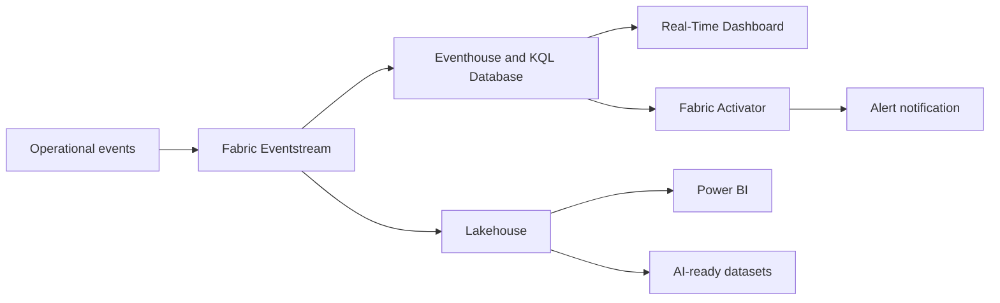

# Fabric Real-Time Intelligence Blueprint

> A practical Microsoft Fabric Real-Time Intelligence learning guide for streaming operational analytics.

## Purpose

This Wiki introduces the Smart Logistics and Operations Monitoring blueprint. It explains how the repository teaches Eventstream, Eventhouse, KQL Database, Real-Time Dashboards, Fabric Activator, Lakehouse, Power BI, governance, cost, and AI-ready extensions.

## Who Should Read This

- Data engineers learning streaming analytics on Fabric.
- BI developers who want to understand real-time operational data.
- Architects designing Fabric Real-Time Intelligence proofs of concept.
- Students and interview candidates preparing scenario-based answers.
- Community contributors extending the blueprint.

## Learning Path

1. [Architecture](Architecture)
2. [Setup Guide](Setup-Guide)
3. [Demo Walkthrough](Demo-Walkthrough)
4. [Event Generator](Event-Generator)
5. [Eventstream Design](Eventstream-Design)
6. [Eventhouse and KQL](Eventhouse-and-KQL)
7. [Data Activator](Data-Activator)
8. [Lakehouse Integration](Lakehouse-Integration)
9. [Power BI Layer](Power-BI-Layer)
10. [Governance and Security](Governance-and-Security)
11. [Cost Optimization](Cost-Optimization)
12. [Troubleshooting](Troubleshooting)
13. [Roadmap](Roadmap)

## Project Flow

## Quick Start

1. Generate local events with the Python generator.
2. Create Eventhouse tables with KQL scripts.
3. Practice live queries.
4. Design dashboard tiles.
5. Configure alert conditions.
6. Land selected events into Lakehouse.
7. Build Power BI reporting over curated summaries.

## Related Repo Files

- [README.md](../README.md)
- [src/event-generator](../src/event-generator)
- [kql](../kql)
- [lakehouse](../lakehouse)
- [powerbi](../powerbi)

## Checklist

- [ ] I understand the business scenario.
- [ ] I know which Fabric components are used.
- [ ] I know the recommended page order.
- [ ] I can explain why Eventhouse and Lakehouse are both used.

Next: [Architecture](Architecture)
