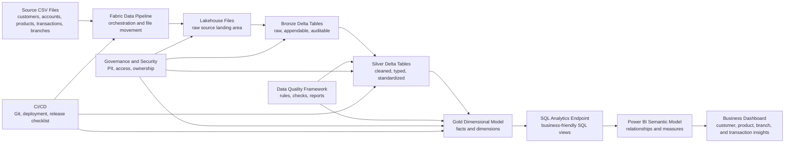
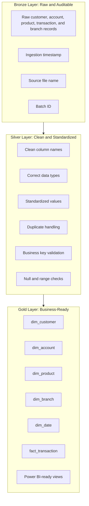

# Microsoft Fabric Data Engineering Blueprint Wiki

> A practical learning portal for building lakehouse-based data engineering solutions with Microsoft Fabric.

Welcome to the Wiki for **fabric-data-engineering-blueprint**. This Wiki is the detailed learning guide, implementation handbook, and knowledge base for the repository. The README introduces the project; this Wiki helps you learn the concepts, run the sample implementation, understand the design decisions, and apply the patterns in real Microsoft Fabric projects.

The blueprint uses a realistic **Retail Banking Customer Analytics** scenario to show how raw CSV files become trusted, governed, business-ready analytics assets through Microsoft Fabric Lakehouse, OneLake, Data Pipelines, Notebooks, PySpark, Delta tables, SQL Analytics Endpoint, and Power BI.

## Project Tagline

**A beginner-friendly and enterprise-oriented Microsoft Fabric Data Engineering blueprint covering Lakehouse, OneLake, Data Pipelines, Notebooks, Spark, Medallion Architecture, Delta Tables, SQL Analytics Endpoint, Power BI consumption, governance, CI/CD, and real-world project structure.**

## What This Wiki Is

This Wiki is designed to feel like a structured learning portal, not a flat documentation dump. It explains the project from multiple angles:

| Area | What the Wiki Helps You Do |
| --- | --- |
| Learning | Understand Microsoft Fabric Data Engineering step by step |
| Implementation | Run the Retail Banking sample project from raw files to Power BI-ready data |
| Architecture | Understand Lakehouse, medallion architecture, dimensional modeling, and data product patterns |
| Decision-making | Choose between Lakehouse, Warehouse, Notebook, Pipeline, Dataflow Gen2, Shortcut, Copy, Direct Lake, and Import |
| Enterprise readiness | Apply governance, access control, naming standards, data quality, CI/CD, and Dev/Test/Prod practices |
| Career growth | Prepare for interviews, portfolio demos, community talks, and Fabric proof-of-concept discussions |

## Who This Wiki Is For

| Audience | Why This Wiki Helps |
| --- | --- |
| Beginners | Learn Fabric Data Engineering without needing to start from abstract theory |
| Azure Data Engineers | Map ADF, Synapse, ADLS, SQL, and Databricks concepts to Fabric patterns |
| Power BI Developers | Understand how curated Lakehouse data becomes a reliable semantic model |
| Data Architects | Review platform, governance, medallion, data product, and CI/CD design patterns |
| Students and Interview Candidates | Build practical examples for interviews and hands-on practice |
| Enterprise Teams | Use the repo as a starting point for a Fabric proof of concept |
| Community Contributors | Extend the blueprint with better examples, diagrams, docs, and implementation patterns |

## What You Will Learn

By working through this Wiki and the repository, you will learn how to:

- Explain what Microsoft Fabric is and how its workloads fit together.
- Use OneLake and Lakehouse concepts correctly.
- Understand the difference between Lakehouse Files and Tables.
- Ingest source CSV files into a Fabric Lakehouse.
- Build Bronze, Silver, and Gold layers using PySpark notebooks.
- Apply data quality checks before promoting data to business-ready layers.
- Design dimensions and facts for a Retail Banking analytics model.
- Query Lakehouse data through the SQL Analytics Endpoint.
- Prepare curated data for Power BI semantic models and dashboards.
- Make practical architecture decisions for Fabric projects.
- Apply governance, naming, security, and PII handling guidance.
- Plan CI/CD and Dev/Test/Prod promotion for Fabric artifacts.
- Avoid common beginner and enterprise mistakes.
- Use the project as a portfolio, interview, or community learning asset.

## How To Use This Wiki

Use this Wiki based on your current goal:

| Goal | Recommended Approach |
| --- | --- |
| Learn from the beginning | Follow the Beginner path in order |
| Run the sample project | Start with Getting Started, then run the notebooks and SQL scripts |
| Prepare for interviews | Study the Decision Guide, Common Mistakes, Glossary, FAQ, and Interview Guide |
| Design an enterprise proof of concept | Focus on Architecture Patterns, Governance, CI/CD, and Dev/Test/Prod |
| Improve Power BI modeling skills | Read Gold Layer, Dimensional Modeling, SQL Endpoint, Power BI, and Semantic Model pages |
| Contribute to the repo | Read the Contributor Guide and choose a focused improvement |

## Recommended Learning Paths

### Beginner Path

Best for learners who are new to Microsoft Fabric or data engineering.

1. [Microsoft Fabric Fundamentals](Microsoft-Fabric-Fundamentals)
2. [OneLake Explained](OneLake-Explained)
3. [Lakehouse Concepts](Lakehouse-Concepts)
4. [Files vs Tables in Fabric Lakehouse](Files-vs-Tables-in-Fabric-Lakehouse)
5. [Getting Started](Getting-Started)
6. [End-to-End Project Walkthrough](End-to-End-Project-Walkthrough)
7. [Medallion Architecture](Medallion-Architecture)
8. [30-Day Learning Plan](30-Day-Learning-Plan)

Outcome: You can explain Fabric basics and run the project from CSV files to curated Delta tables.

### Azure Data Engineer Transition Path

Best for engineers moving from Azure Data Factory, Synapse, ADLS Gen2, SQL, or Databricks into Microsoft Fabric.

1. [Fabric Data Engineering Overview](Fabric-Data-Engineering-Overview)
2. [OneLake Explained](OneLake-Explained)
3. [Lakehouse vs Warehouse](Lakehouse-vs-Warehouse)
4. [Data Pipelines vs Notebooks](Data-Pipelines-vs-Notebooks)
5. [Dataflow Gen2 vs Notebook vs Pipeline](Dataflow-Gen2-vs-Notebook-vs-Pipeline)
6. [CI/CD and Deployment Strategy](CICD-and-Deployment-Strategy)
7. [Dev/Test/Prod Workspace Strategy](Dev-Test-Prod-Workspace-Strategy)
8. [90-Day Professional Growth Plan](90-Day-Professional-Growth-Plan)

Outcome: You can translate familiar Azure architecture patterns into Fabric implementation choices.

### Power BI Developer Path

Best for Power BI developers who want to understand Lakehouse engineering and semantic model readiness.

1. [Gold Layer Design](Gold-Layer-Design)
2. [Dimensional Modeling in Fabric](Dimensional-Modeling-in-Fabric)
3. [Building Dimensions and Facts](Building-Dimensions-and-Facts)
4. [SQL Analytics Endpoint Guide](SQL-Analytics-Endpoint-Guide)
5. [Power BI Consumption Guide](Power-BI-Consumption-Guide)
6. [Semantic Model Design](Semantic-Model-Design)
7. [Fabric Decision Guide](Fabric-Decision-Guide)

Outcome: You can explain why Power BI should consume curated Gold data instead of raw operational files.

### Data Architect Path

Best for solution architects, platform owners, and technical leads designing Fabric adoption patterns.

1. [Real-World Architecture Patterns](Real-World-Architecture-Patterns)
2. [Medallion Architecture](Medallion-Architecture)
3. [Fabric Decision Guide](Fabric-Decision-Guide)
4. [Governance and Security](Governance-and-Security)
5. [Access Control Model](Access-Control-Model)
6. [PII and Sensitive Data Handling](PII-and-Sensitive-Data-Handling)
7. [Architecture Decision Records Guide](Architecture-Decision-Records-Guide)
8. [Performance and Optimization](Performance-and-Optimization)

Outcome: You can evaluate a Fabric proof of concept for scalability, governance, access, performance, and maintainability.

### Interview Preparation Path

Best for students, job seekers, and professionals preparing for Microsoft Fabric Data Engineering interviews.

1. [Glossary](Glossary)
2. [FAQ](FAQ)
3. [Common Mistakes and How to Avoid Them](Common-Mistakes-and-How-to-Avoid-Them)
4. [Fabric Decision Guide](Fabric-Decision-Guide)
5. [Interview Preparation Guide](Interview-Preparation-Guide)
6. [Retail Banking Sample Domain](Retail-Banking-Sample-Domain)
7. [Building Dimensions and Facts](Building-Dimensions-and-Facts)

Outcome: You can answer conceptual, scenario-based, and architecture questions using a real project example.

## Complete Wiki Navigation

| # | Page | Use This Page To |
| ---: | --- | --- |
| 1 | [Home](Home) | Choose your path and understand the Wiki structure |
| 2 | [Getting Started](Getting-Started) | Set up Fabric, upload data, run notebooks, and validate outputs |
| 3 | [Microsoft Fabric Fundamentals](Microsoft-Fabric-Fundamentals) | Understand Fabric workloads and platform concepts |
| 4 | [Fabric Data Engineering Overview](Fabric-Data-Engineering-Overview) | Learn how Lakehouse, notebooks, Spark, pipelines, and SQL endpoint work together |
| 5 | [OneLake Explained](OneLake-Explained) | Understand OneLake, shortcuts, workspaces, Files, and Tables |
| 6 | [Lakehouse Concepts](Lakehouse-Concepts) | Learn Lakehouse storage, metadata, Delta, Spark, SQL, and Power BI access |
| 7 | [Lakehouse vs Warehouse](Lakehouse-vs-Warehouse) | Decide between Fabric Lakehouse and Warehouse |
| 8 | [Files vs Tables in Fabric Lakehouse](Files-vs-Tables-in-Fabric-Lakehouse) | Know when to use raw files versus managed Delta tables |
| 9 | [Data Pipelines vs Notebooks](Data-Pipelines-vs-Notebooks) | Decide between orchestration and code-based transformation |
| 10 | [Dataflow Gen2 vs Notebook vs Pipeline](Dataflow-Gen2-vs-Notebook-vs-Pipeline) | Choose the right transformation and orchestration tool |
| 11 | [End-to-End Project Walkthrough](End-to-End-Project-Walkthrough) | Follow the complete Retail Banking implementation flow |
| 12 | [Retail Banking Sample Domain](Retail-Banking-Sample-Domain) | Understand customers, accounts, products, transactions, branches, and dates |
| 13 | [Sample Dataset Guide](Sample-Dataset-Guide) | Learn each CSV file, key columns, relationships, and quality expectations |
| 14 | [Medallion Architecture](Medallion-Architecture) | Understand Bronze, Silver, and Gold design principles |
| 15 | [Bronze Layer Design](Bronze-Layer-Design) | Design raw, auditable ingestion tables |
| 16 | [Silver Layer Design](Silver-Layer-Design) | Clean, standardize, deduplicate, and validate data |
| 17 | [Gold Layer Design](Gold-Layer-Design) | Build business-ready facts, dimensions, and consumption views |
| 18 | [Dimensional Modeling in Fabric](Dimensional-Modeling-in-Fabric) | Learn star schema, facts, dimensions, keys, and grain |
| 19 | [Building Dimensions and Facts](Building-Dimensions-and-Facts) | Build dim_customer, dim_account, dim_product, dim_branch, dim_date, and fact_transaction |
| 20 | [SQL Analytics Endpoint Guide](SQL-Analytics-Endpoint-Guide) | Query Lakehouse tables and create SQL views for consumers |
| 21 | [Power BI Consumption Guide](Power-BI-Consumption-Guide) | Connect Power BI to Fabric and consume Gold data responsibly |
| 22 | [Semantic Model Design](Semantic-Model-Design) | Define measures, relationships, naming, glossary, and metric standards |
| 23 | [Data Quality Framework](Data-Quality-Framework) | Use dq_rules.yml and dq_framework.py for quality checks |
| 24 | [Governance and Security](Governance-and-Security) | Apply ownership, stewardship, least privilege, and auditability |
| 25 | [Access Control Model](Access-Control-Model) | Design roles and access by Bronze, Silver, and Gold layers |
| 26 | [PII and Sensitive Data Handling](PII-and-Sensitive-Data-Handling) | Identify and protect sensitive banking data |
| 27 | [Naming Standards](Naming-Standards) | Apply clear names for workspaces, lakehouses, notebooks, pipelines, tables, columns, and views |
| 28 | [CI/CD and Deployment Strategy](CICD-and-Deployment-Strategy) | Plan Git integration, deployment pipelines, promotion, and releases |
| 29 | [Dev/Test/Prod Workspace Strategy](Dev-Test-Prod-Workspace-Strategy) | Separate environments and promote Fabric assets safely |
| 30 | [Performance and Optimization](Performance-and-Optimization) | Improve Delta, Spark, SQL, and Power BI performance |
| 31 | [Common Mistakes and How to Avoid Them](Common-Mistakes-and-How-to-Avoid-Them) | Avoid common beginner and enterprise implementation issues |
| 32 | [Architecture Decision Records Guide](Architecture-Decision-Records-Guide) | Capture architecture choices with ADRs |
| 33 | [Fabric Decision Guide](Fabric-Decision-Guide) | Use decision matrices for common Fabric architecture choices |
| 34 | [Real-World Architecture Patterns](Real-World-Architecture-Patterns) | Compare small team, enterprise, data product, self-service BI, AI-ready, and regulated patterns |
| 35 | [Interview Preparation Guide](Interview-Preparation-Guide) | Practice beginner, intermediate, scenario, and architecture interview answers |
| 36 | [30-Day Learning Plan](30-Day-Learning-Plan) | Follow a beginner-friendly month-long learning plan |
| 37 | [90-Day Professional Growth Plan](90-Day-Professional-Growth-Plan) | Build professional Fabric Data Engineering capability over three months |
| 38 | [Contributor Guide](Contributor-Guide) | Learn how to improve the repo and Wiki |
| 39 | [FAQ](FAQ) | Find answers to common Fabric and project questions |
| 40 | [Glossary](Glossary) | Learn key Microsoft Fabric, lakehouse, modeling, governance, and CI/CD terms |

## End-to-End Project Architecture

The blueprint follows a practical CSV-to-dashboard flow. The goal is not only to load data, but to create a trusted, explainable, and reusable analytics foundation.

## Medallion Architecture

The project uses a medallion architecture so each layer has a clear responsibility.

## Retail Banking Customer Analytics Scenario

This Wiki uses a Retail Banking Customer Analytics project because it contains familiar business entities and realistic data engineering concerns.

| Entity | Business Meaning | Example Questions |
| --- | --- | --- |
| Customer | A person or organization that holds banking products | How many active customers do we have? What segments are growing? |
| Account | A banking account owned by a customer | Which accounts have high balances or high activity? |
| Product | A banking product such as checking, savings, credit card, or loan | Which products are most used? |
| Transaction | A financial activity on an account | What is transaction volume by month? What are transaction trends? |
| Branch | A physical or organizational banking location | Which branches have high transaction activity? |
| Date | A reusable calendar dimension | How do balances and transactions trend over time? |

The final Gold model supports analysis such as:

- Active customer count
- Account count
- Transaction count
- Total transaction amount
- Average transaction amount
- Product usage
- Branch activity
- Customer segment distribution
- Monthly transaction trends
- Account balance trends

## Quick Start Steps

Use these steps when you want to run the project hands-on.

1. Open the main repository: [fabric-data-engineering-blueprint](https://github.com/ravikiranpagidi/fabric-data-engineering-blueprint).
2. Review the sample files in [sample-data](https://github.com/ravikiranpagidi/fabric-data-engineering-blueprint/tree/main/sample-data).
3. Create a Microsoft Fabric workspace.
4. Create a Lakehouse for the project.
5. Upload the CSV files into the Lakehouse Files area.
6. Run notebooks in order from [notebooks](https://github.com/ravikiranpagidi/fabric-data-engineering-blueprint/tree/main/notebooks):
   - `00_setup_lakehouse.ipynb`
   - `01_bronze_ingestion.ipynb`
   - `02_silver_transformation.ipynb`
   - `03_gold_dimensional_model.ipynb`
   - `04_data_quality_checks.ipynb`
   - `05_delta_optimization.ipynb`
   - `06_powerbi_ready_views.ipynb`
7. Run SQL scripts from [sql](https://github.com/ravikiranpagidi/fabric-data-engineering-blueprint/tree/main/sql) through the SQL Analytics Endpoint.
8. Build or connect a Power BI semantic model using the Gold tables and views.
9. Review governance, CI/CD, and production readiness pages before using the pattern in an enterprise proof of concept.

Expected result: a working Fabric Lakehouse implementation with Bronze raw tables, Silver cleaned tables, Gold dimensions and facts, SQL views, data quality checks, and Power BI consumption guidance.

## Key Repo Folders

| Folder | Purpose |
| --- | --- |
| [docs](https://github.com/ravikiranpagidi/fabric-data-engineering-blueprint/tree/main/docs) | Conceptual documentation for Fabric Data Engineering topics |
| [architecture](https://github.com/ravikiranpagidi/fabric-data-engineering-blueprint/tree/main/architecture) | Architecture diagrams and design explanations |
| [sample-data](https://github.com/ravikiranpagidi/fabric-data-engineering-blueprint/tree/main/sample-data) | Retail Banking CSV files used by the project |
| [notebooks](https://github.com/ravikiranpagidi/fabric-data-engineering-blueprint/tree/main/notebooks) | Fabric-compatible PySpark notebooks for setup, ingestion, transformation, modeling, quality, optimization, and views |
| [pipelines](https://github.com/ravikiranpagidi/fabric-data-engineering-blueprint/tree/main/pipelines) | Pipeline templates and orchestration guidance |
| [sql](https://github.com/ravikiranpagidi/fabric-data-engineering-blueprint/tree/main/sql) | SQL Analytics Endpoint scripts, metrics, validations, and Power BI-ready views |
| [data-quality](https://github.com/ravikiranpagidi/fabric-data-engineering-blueprint/tree/main/data-quality) | Rule-driven data quality framework and examples |
| [semantic-model](https://github.com/ravikiranpagidi/fabric-data-engineering-blueprint/tree/main/semantic-model) | Power BI semantic model guidance, measures, and business glossary |
| [governance](https://github.com/ravikiranpagidi/fabric-data-engineering-blueprint/tree/main/governance) | Access control, PII, naming, ownership, and governance checklist |
| [cicd](https://github.com/ravikiranpagidi/fabric-data-engineering-blueprint/tree/main/cicd) | Git integration, deployment pipeline, environment, and release guidance |
| [adr](https://github.com/ravikiranpagidi/fabric-data-engineering-blueprint/tree/main/adr) | Architecture Decision Records explaining key design choices |
| [interview-guide](https://github.com/ravikiranpagidi/fabric-data-engineering-blueprint/tree/main/interview-guide) | Interview questions, scenarios, architecture prompts, and practice tasks |
| [roadmap](https://github.com/ravikiranpagidi/fabric-data-engineering-blueprint/tree/main/roadmap) | Beginner, intermediate, and advanced learning paths |
| [community](https://github.com/ravikiranpagidi/fabric-data-engineering-blueprint/tree/main/community) | Blog, YouTube, meetup, and contribution planning resources |

## Suggested First Milestones

| Milestone | What To Complete | Proof You Are Learning |
| --- | --- | --- |
| Orientation | Read Home, Getting Started, Fabric Fundamentals, and OneLake | You can explain what Fabric and OneLake are |
| First run | Upload sample CSVs and run setup plus Bronze notebook | Bronze Delta tables exist with ingestion metadata |
| Clean data | Run Silver notebook and review transformation rules | Silver tables have clean types, names, and valid keys |
| Business model | Run Gold notebook and SQL views | You can explain facts, dimensions, and table grain |
| Quality gate | Run data quality notebook and review results | You can describe pass/fail checks and fixes |
| Consumption | Review SQL endpoint and Power BI guidance | You can design a basic semantic model |
| Enterprise lens | Review governance, CI/CD, and mistakes pages | You can explain production readiness gaps |

## Contribution Invitation

This project is intended to grow as a community learning resource for Microsoft Fabric Data Engineering. Contributions are welcome in many forms:

- Improve explanations for beginners.
- Add diagrams or screenshots.
- Add new notebook examples.
- Add more data quality rules.
- Add SQL validation and business metric examples.
- Add Power BI semantic model guidance.
- Add architecture decision records.
- Add interview questions and hands-on tasks.
- Add real-world implementation notes from Fabric projects.
- Fix typos, broken links, unclear wording, or inconsistent naming.

Start with the [Contributor Guide](Contributor-Guide), then open a focused issue or pull request.

## Professional Closing Note

Microsoft Fabric is most valuable when teams understand both the platform and the engineering discipline behind it. This Wiki is designed to help learners move beyond isolated demos and toward clear, maintainable, governed, and business-ready data solutions.

Use the blueprint as a learning project, a proof-of-concept starter, an interview preparation resource, a community contribution base, or a reference architecture discussion guide.

## Summary Checklist

- [ ] I know what this Wiki is and how it differs from the README.
- [ ] I selected the learning path that fits my background.
- [ ] I understand the end-to-end CSV-to-dashboard architecture.
- [ ] I understand the Bronze, Silver, and Gold layer responsibilities.
- [ ] I know where the key repo folders are located.
- [ ] I know which Wiki page to read next.

---

## Page Navigation

| Previous | Home | Next |
| --- | --- | --- |
| Start here | [Home](Home) | [Getting Started](Getting-Started) |

Helpful references: [FAQ](FAQ) | [Glossary](Glossary) | [Contributor Guide](Contributor-Guide)
